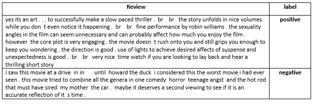

# sentiment-analysis-nn
- using NN implemented from scratch to predict the sentiment of a given movie review. 
## sections included in sentiment-analysis jupyter file
1. load and view dataset
2. understanding dataset and Developing a "Predictive Theory"
3. building nn model
4. training and testing the model

## Dataset
- dataset is a text file has 25000 line separated movie reviews in [review.txt](dataset/reviews.txt) and labels are in [labels.txt](dataset/labels.txt)
- labels are strings `POSTIVE` for positive reviews and `NEGATIVE` for negative reviews
- **sample**
  - 
## installation
- all dependencies exists in [requirements.txt](/requirements.txt) use `pip install -r requirements.txt` to install all requirements
- methods and classes used in [sentiment-analysis jupyter file](sentiment-analysis.ipynb) exists in [helper python file](helper.py)
